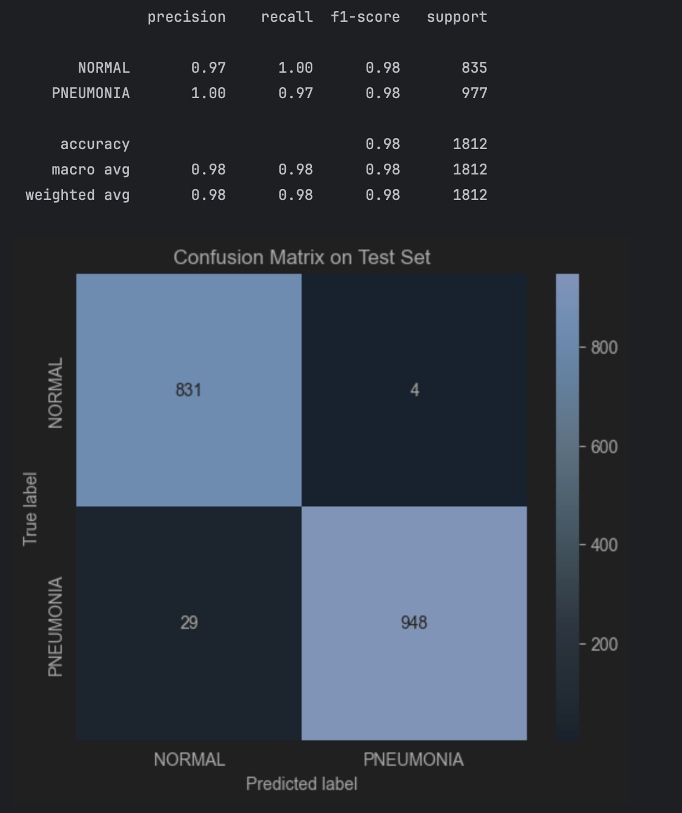
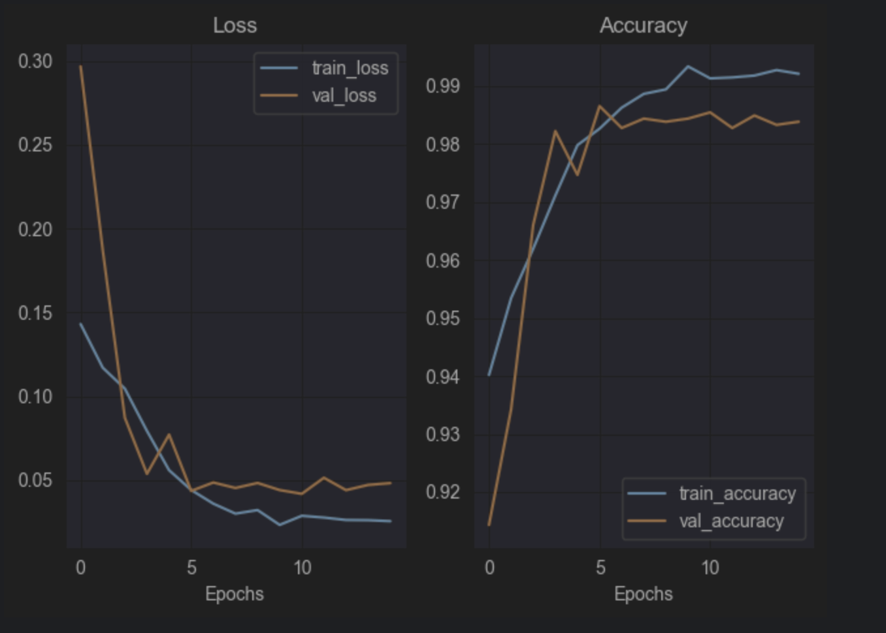
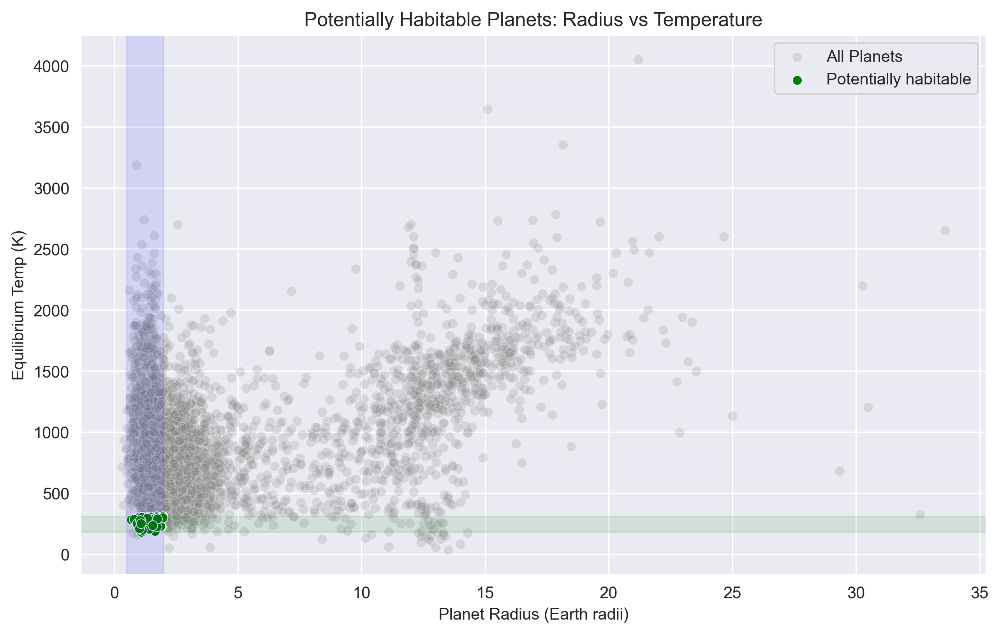
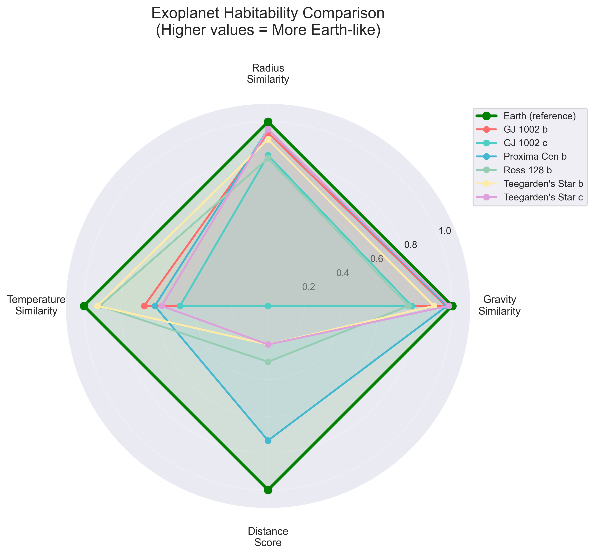

  

# Student of Computer Science - Data Scientist

### Education 

- Bachelor of Science (Honours) Computer Science and Information Technology - University Of Galway  
  > Average Grade: First Class Honours  

- PLC in Software Development - Galway Technical Institute  
  > Final Grade: Full Distinction  

### Work Experience

- Data Analyst/AI trainer @ Outlier AI (May 2025 - Present)  
- Sales Person @ Harvey Norman (April 2022 - May 2025)  

---

## Projects

### Machine Learning Pneumonia Classifier (CNN)  
[Publication](https://github.com/elfudo3/pneumonia_xray_classifier)  

> Developed a deep learning model using **PyTorch** to detect pneumonia from chest X-ray images. I balanced the dataset, applied preprocessing (grayscale, resize, normalize), and fine-tuned a ResNet18 model, achieving ~98% test accuracy. The project includes clear folder structure, Jupyter notebooks, and evaluation with training/validation/test splits.  
> **Tech Stack:** PyTorch, Python, NumPy, Matplotlib, Pandas, Jupyter  

  
  

---

### Exoplanet Habitability Analysis (EDA) - NASA Exoplanet Archive  
[Publication](https://github.com/elfudo3/exoplanet-habitability)  

> Built an exploratory data analysis pipeline on NASA’s exoplanet archive to identify potentially habitable worlds. Applied filtering criteria (radius, mass, temperature, spectral type, distance), engineered a custom habitability score, and visualized results with scatter plots and radar charts comparing candidates to Earth. Produced a ranked shortlist of six promising exoplanets.  
> **Tech Stack:** Pandas, Python, NumPy, Matplotlib, Seaborn, Jupyter  

  
  

